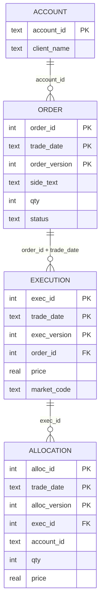

# DataGuard data model

## Logical model
The same three entities appear in every layer (source, work, target), linked by order, execution and allocation keys.

Primary keys shown are the logical keys in the target. No constraints are enforced in the database on purpose, so bad data can land and the checks can catch it.

## Layers
| Layer | Prefix | Purpose | Written by |
|---|---|---|---|
| Source | `src_` | Raw data from upstream, read-only | seed data |
| Work | `wrk_` | Current state, rebuilt every run | steps 1-5 |
| Target | `tgt_` | Published history, one row per version | step 5 only |
| Views | `vw_` | Last version, latest version, delta | steps 2-4 |

## Columns (in table order) with one sample row
Sample rows follow order 1003 and its execution 104 and allocation 205 through the pipeline.

### Orders
| Table | Columns | Grain | Sample row for 1003 |
|---|---|---|---|
| `src_orders` | event_id, order_id, trade_date, event_type, venue, instrument_type, source_system, account_id, side_code, qty, status, source_batch_id | one row per order event | 9003, 1003, 2024-01-15, AMEND, VEN_B, OPT, SYS1, ACC3, '1', 300, OPEN, B5 |
| `wrk_orders` | order_id, event_id, trade_date, qty, status, side_code, client_name, source_batch_id | latest event per order and date | 1003, 9003, 2024-01-15, 300, OPEN, '1', UNKNOWN, B5 |
| `wrk_orders_ver` | order_id, trade_date, order_version, source_batch_id, qty, status, client_name, side_text | one row per order and date, with version | 1003, 2024-01-15, 2, B5, 300, OPEN, UNKNOWN, BUY |
| `tgt_orders` | order_id, trade_date, order_version, source_batch_id, qty, status, client_name, side_text | one row per order, date and version | v1 (B4) and v2 (B5), both kept |

### Executions
| Table | Columns | Grain | Sample row for 104 |
|---|---|---|---|
| `src_executions` | exec_id, order_id, trade_date, qty, price, market_code, source_batch_id | one row per execution | 104, 1003, 2024-01-15, 300, 1600.0, EXCH, B5 |
| `wrk_executions` | exec_id, order_id, trade_date, qty, price, market_code, source_batch_id | executions whose parent order survived | 104, 1003, 2024-01-15, 300, 1600.0, EXCH, B5 |
| `wrk_executions_ver` | exec_id, order_id, trade_date, exec_version, source_batch_id, qty, price, market_code | with version, OFFX mapped to OTC | 104, 1003, 2024-01-15, 2, B5, 300, 1600.0, EXCH |
| `tgt_executions` | exec_id, order_id, trade_date, exec_version, source_batch_id, qty, price, market_code | one row per execution, date and version | v1 (B4) and v2 (B5) |

### Allocations
| Table | Columns | Grain | Sample row for 205 |
|---|---|---|---|
| `src_allocations` | alloc_id, exec_id, order_id, trade_date, account_id, qty, price, source_batch_id | one row per allocation | 205, 104, 1003, 2024-01-15, ACC3, 300, 1600.0, B5 |
| `wrk_allocations` | alloc_id, exec_id, order_id, trade_date, account_id, qty, price, source_batch_id | allocations whose parent execution survived | 205, 104, 1003, 2024-01-15, ACC3, 300, 1600.0, B5 |
| `wrk_allocations_ver` | alloc_id, order_id, trade_date, alloc_version, source_batch_id, exec_id, account_id, qty, price | with version | 205, 1003, 2024-01-15, 2, B5, 104, ACC3, 300, 1600.0 |
| `tgt_allocations` | alloc_id, order_id, trade_date, alloc_version, source_batch_id, exec_id, account_id, qty, price | one row per allocation, date and version | v1 (B4) and v2 (B5) |

### Supporting tables
| Table | Columns | Content after a good run |
|---|---|---|
| `src_accounts` | account_id, client_name | ACC1 Alpha Capital, ACC2 Beta Funds (ACC3 is deliberately missing) |
| `etl_reject_log` | source_table, record_id, reason | executions 107 (parent order not found), allocations 208 (parent execution not found) |
| `wrk_change_scope` | order_id, trade_date | (1001, 2024-01-15), (1002, 2024-01-15), (1003, 2024-01-15) |

### Views
| View | Purpose |
|---|---|
| `vw_orders_last_ver`, `vw_exec_last_ver`, `vw_alloc_last_ver` | Highest published version of this key on this trade date |
| `vw_orders_latest_ver`, `vw_exec_latest_ver`, `vw_alloc_latest_ver` | Highest published version of this key across all dates |
| `vw_orders_delta`, `vw_exec_delta`, `vw_alloc_delta` | New or changed rows: versioned work table `EXCEPT` published target |

## Row counts after a good run
| Table | Rows | | Table | Rows |
|---|---|---|---|---|
| src_orders | 12 | | wrk_orders_ver | 5 |
| src_executions | 7 | | wrk_executions_ver | 6 |
| src_allocations | 8 | | wrk_allocations_ver | 7 |
| wrk_orders | 5 | | tgt_orders | 7 |
| wrk_executions | 6 | | tgt_executions | 8 |
| wrk_allocations | 7 | | tgt_allocations | 9 |
