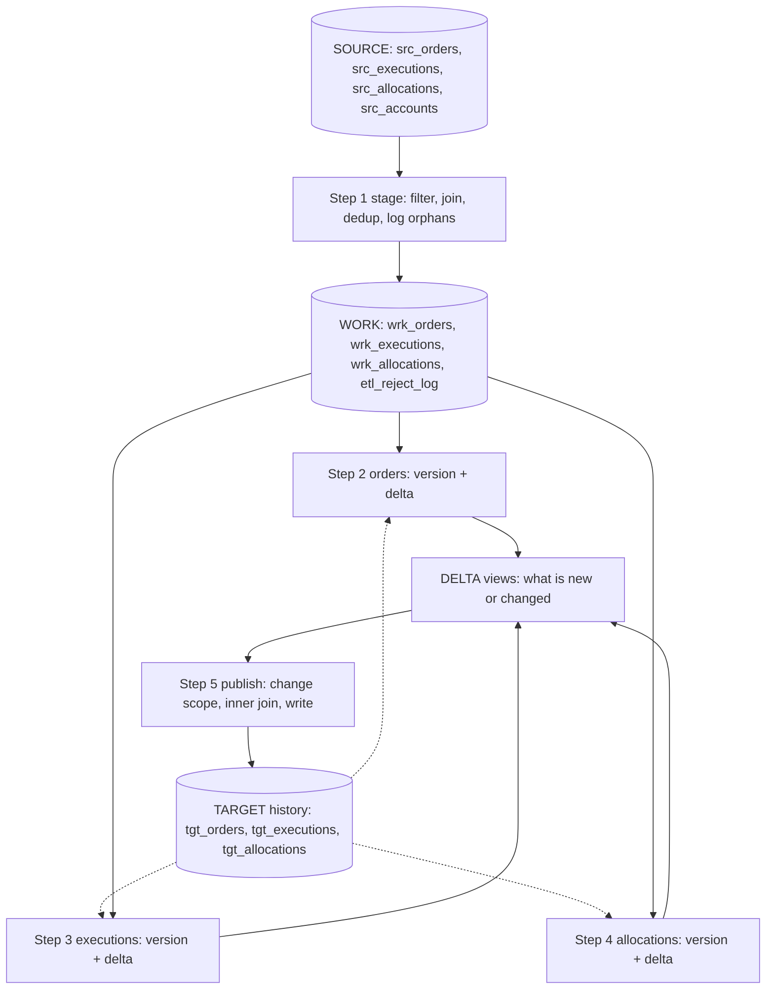

# DataGuard process map

## Flow

## Steps
| Step | File | What it does | Reads | Details | Writes | Checks that run after it |
|---|---|---|---|---|---|---|
| 1 | `1_stage.sql` | Picks the in-scope raw data, cleans it, and throws out orphans | src_* | venue / instrument / source / event / date filters; left join accounts; keep latest event per order+date; reject orphan executions and allocations | wrk_orders, wrk_executions, wrk_allocations, etl_reject_log | RC01-05, FL01-02, BD01, DU01-02, DD01, NL01-03, RI01-03 |
| 2 | `2_orders.sql` | Decides each order's version and finds which orders are new or changed | wrk_orders, tgt_orders | assign version, map side code to text, build delta | wrk_orders_ver, vw_orders_delta | TR01, VR01, DF01 |
| 3 | `3_executions.sql` | Same as step 2, for executions | wrk_executions, tgt_executions | assign version, map OFFX to OTC, build delta | wrk_executions_ver, vw_exec_delta | TR02, VR02, DF02 |
| 4 | `4_allocations.sql` | Same as step 2, for allocations | wrk_allocations, tgt_allocations | assign version, build delta | wrk_allocations_ver, vw_alloc_delta | VR03, DF03, DF04, BR01 |
| 5 | `5_publish.sql` | Writes only the new/changed rows into the target history | the 3 deltas + 3 versioned work tables | build change scope; inner join each work table to it; insert | wrk_change_scope, tgt_* | PB01-03, RC06, DU03, NL04, RI04, ST01-03, ID01 |

## The three ideas
1. **Stage:** shape the current state from source (step 1).
2. **Version + delta:** compare with what is already published; delta = latest `EXCEPT` published (steps 2-4, the same loop three times).
3. **Publish:** only changed keys are written, and only step 5 writes to target.

**Version rule** (steps 2-4): no history anywhere = 1 | exists on other dates only = latest + 1 | exists this date and source batch changed = last + 1 | exists this date, unchanged = keep.

## Things that trip people up
- Delta views recompute on read. After publish they are empty, so delta checks run BEFORE step 5 (stage 4) and target checks run AFTER (stage 5).
- The change scope is a table, not a view, because the first target insert would otherwise change the delta mid-publish.
- A row filtered out by the rules is not a reject. Only orphans (no parent) go to `etl_reject_log`, so reconciliation is: in-window source rows = loaded + rejected.
- Publish writes ALL work rows for a changed key, not only the changed ones.

## Where bugs hide (and which step to suspect)
| Symptom | Look at |
|---|---|
| Rows missing in a work table | Step 1: WHERE filters, join type, date window |
| Wrong or skipped version | The version CASE in the step for that entity |
| Delta has extra or missing rows | The EXCEPT columns, the version logic |
| Target not updated, or duplicated | Step 5: scope build and join keys (order_id + trade_date) |
| Values differ from source | The transformation in that step (mapping, price, qty) |

Almost every real defect is a join key or filter problem, not business logic.
